# 📘 Student e-Journal Web Application

This is a web application for managing student grades, subjects, and school structures. It supports multiple user roles: **admin**, **director**, **teacher**, and **student**. Built with Node.js, Express.js, Sequelize ORM, and MySQL. It uses Passport.js for authentication and ACL for role-based access control.

---

## 🎯 Key Features

✅ Multi-role user system (Admin, Director, Teacher, Student)  
✅ Admin panel for managing all users and schools  
✅ Director panel to manage their school and assign teachers/students  
✅ Teacher panel to manage subjects and assign grades  
✅ Student access to view grades  
✅ Passwords hashed securely using bcrypt  
✅ Authentication with Passport.js  
✅ Role-based permissions using ACL  
✅ EJS template engine for views  
✅ Supports multiple schools  
✅ Full CRUD support for users, grades, and subjects  

---

## 👤 Predefined Test Users

These users are preloaded for testing purposes and can be used to log in immediately:

| Role       | Email                    | Password |
|------------|--------------------------|----------|
| Admin      | `admin@example.com`      | `test`   |
| Director 1 | `director@example.com`   | `test`   |
| Director 2 | `director2@example.com`  | `test`   |
| Teacher    | `teacher@example.com`    | `test`   |
| Teacher 2  | `halina@example.com`     | `test`   |
| Student 1  | `student1@example.com`   | `test`   |
| Student 2  | `student2@example.com`   | `test`   |
| Student 3  | `student3@example.com`   | `test`   |

🔐 *These accounts are created on server start and stored in the database. Passwords are securely hashed using bcrypt.*

---

## 🛠️ Technologies Used

- **Node.js**
- **Express.js**
- **Sequelize ORM**
- **MySQL**
- **Passport.js**
- **ACL (Access Control List)**
- **bcrypt.js**
- **EJS (Embedded JavaScript Templates)**


## 🧱 Project Structure

```

├── controllers/                  # Application logic
├── models/                       # Sequelize models
│   ├── grade.model.js
│   ├── school.model.js
│   ├── subject.model.js
│   ├── user.model.js
│   └── schemas.js
├── utility/                      # Helpers and DB config
│   ├── aclauth.js
│   ├── auth.js
│   ├── db.js
│   └── permissions.js
├── helpers/
│   └── htmlHelper.js             # View helpers
├── views/
│   ├── partials/                 # Shared EJS components
│   │   ├── footer.ejs
│   │   ├── head.ejs
│   │   └── navbar.ejs
│   ├── subjects/
│   │   ├── index.ejs
│   │   ├── student\_mysubjects.ejs
│   │   ├── subject\_add.ejs
│   │   ├── subject\_addgrade.ejs
│   │   ├── subject\_addstudent.ejs
│   │   ├── subject\_edit.ejs
│   │   ├── subject\_grades.ejs
│   │   ├── subject\_view\.ejs
│   │   └── teacher\_mysubjects.ejs
│   ├── grades/
│   │   ├── grade\_add.ejs
│   │   ├── grade\_edit.ejs
│   │   ├── grade\_view\.ejs
│   │   └── index.ejs
│   ├── admin/
│   │   ├── schools/
│   │   │   └── user\_add.ejs
│   │   ├── user\_edit.ejs
│   │   ├── user\_view\.ejs
│   │   ├── users\_add.ejs
│   │   ├── users\_edit.ejs
│   │   └── users.ejs
│   ├── dashboard.ejs
│   ├── index.ejs
│   ├── login.ejs
│   └── register.ejs
├── public/
│   └── style.css                 # Static styles
├── screenshots/                 # UI screenshots
├── node\_modules/               # Installed dependencies
├── package.json                # Project metadata and scripts
├── package-lock.json
└── server.js                   # Main application entry point

```

## 🚀 How to Run Locally

1. **Clone the repository:**
```bash
git clone https://github.com/Jaroslaw-Baumgart/Student-e-Journal
cd Student-e-Journal
```

2. **Install dependencies:**

```bash
npm install
```

3. **Set up the MySQL database:**

   Start XAMPP and enable the MySQL and Apache servers.

4. **Run the application:**

```bash
node server.js
```

5. **Open your browser and visit:**

```
http://localhost:3010
```

---

## 📸 Screenshots

### 📂 Core Interface

#### 🏠 Home Page
Landing page with login/register options.


#### 🔐 Login Page
Secure login form for all user roles. Authenticates users using Passport.js.
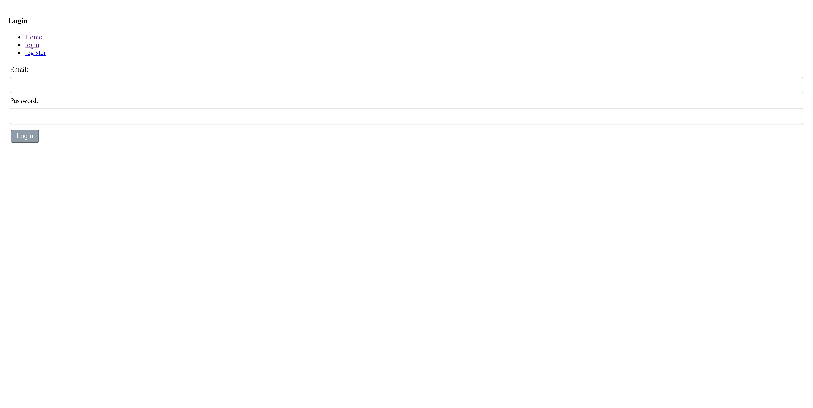

#### 📝 Register Page
User registration form.
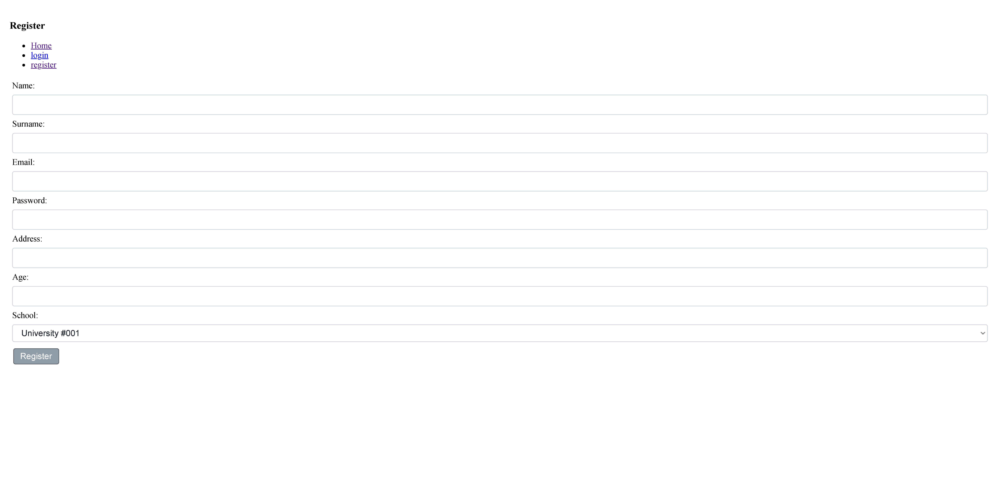

#### Dashboard
After successful login.


#### 🛑 Access Forbidden
Displayed when a user tries to access a page without the required permissions. Role-based access control prevents unauthorized actions.


### 🛠️ Admin Panel

#### Admin – Schools List
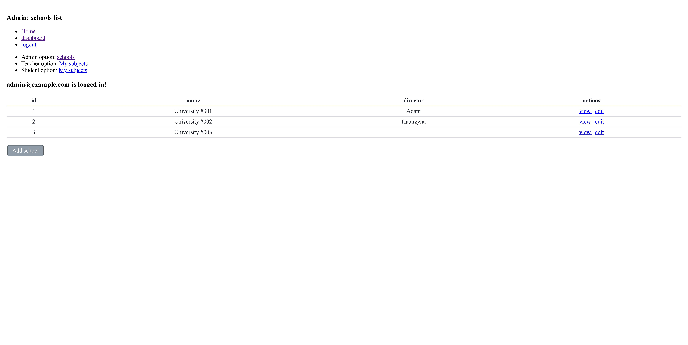

#### Admin – Edit Schools
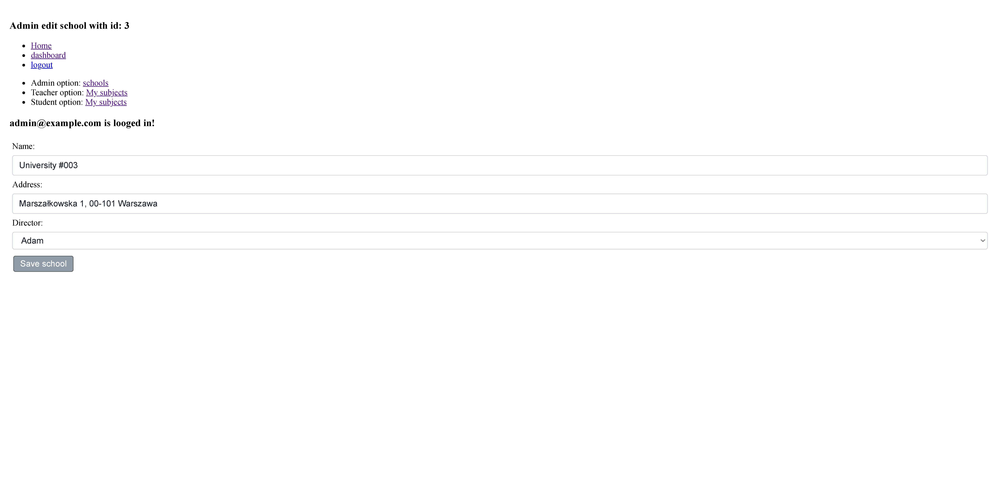

#### Admin – View Schools
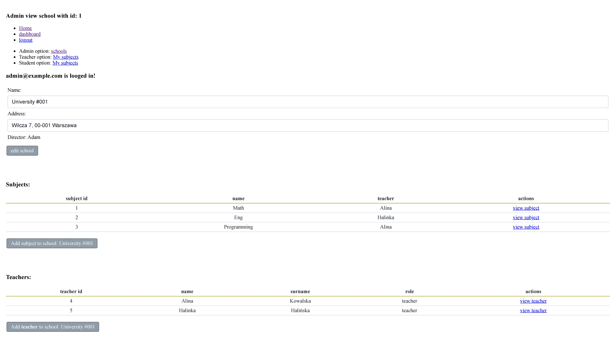

#### Admin – View Subject
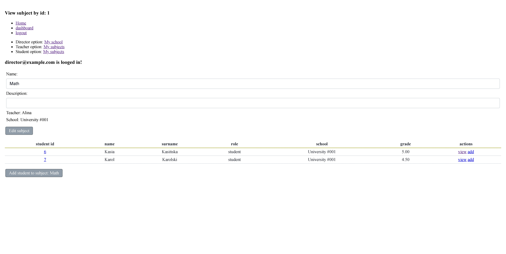

### 🎓 Director Panel

#### Director - Options
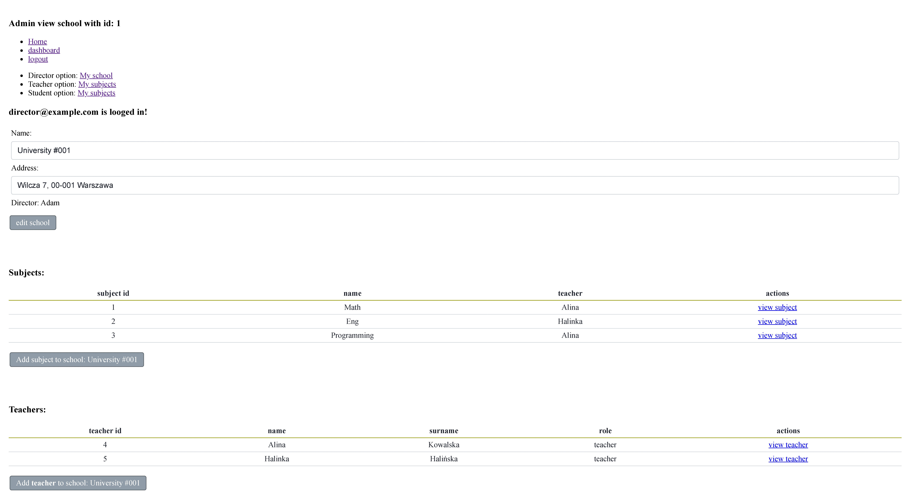

#### Director – View Teacher
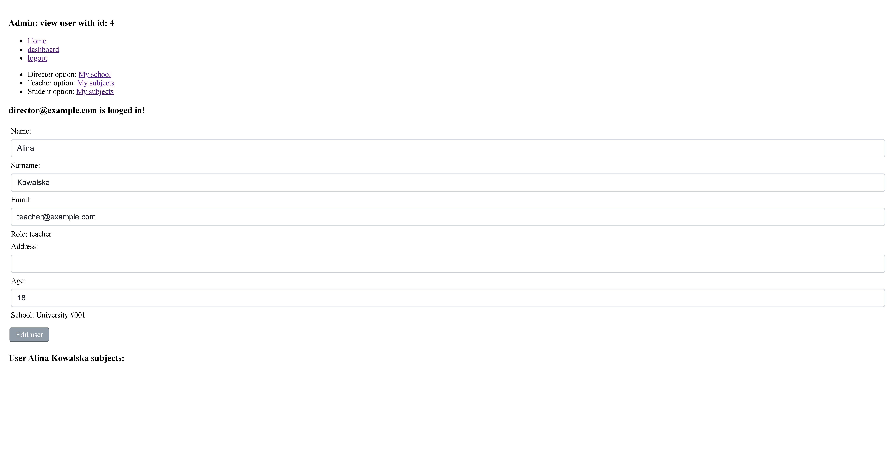

### 👩‍🏫 Teacher Panel

#### Teacher - Options
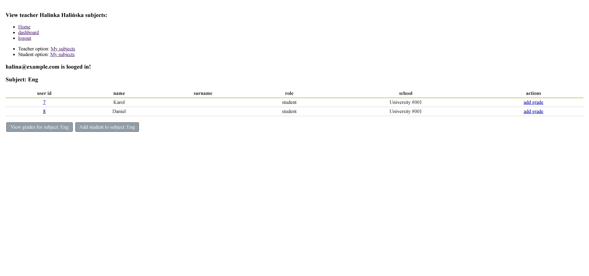

#### Teacher - Add Grade
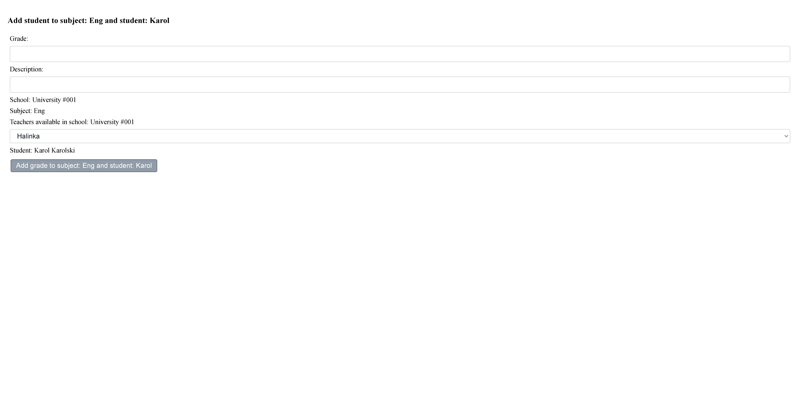

#### Teacher - Add Student to subject 
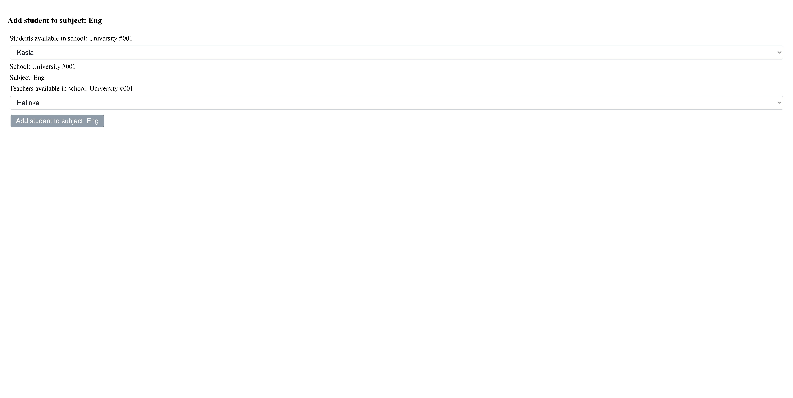

#### Teacher - View Grade
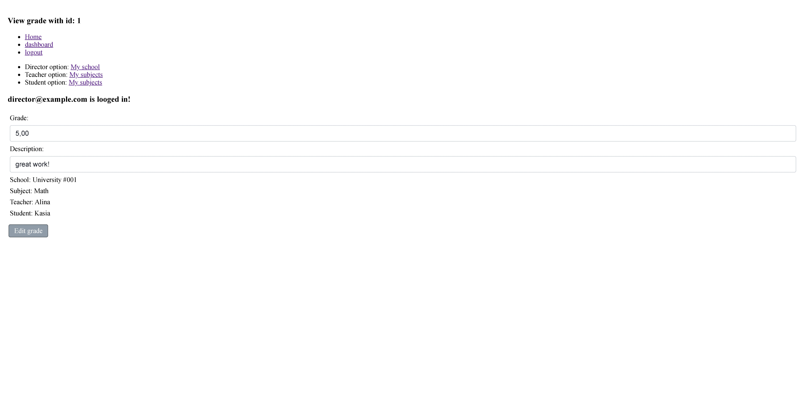

#### Teacher - View Grade For Subject
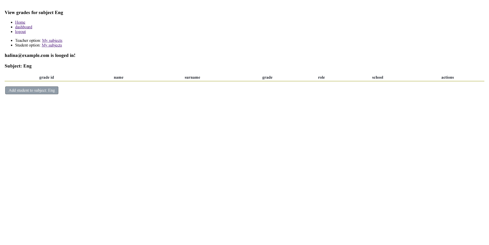

### 👨‍🎓 Student Panel

#### Student - View Grade And Subject
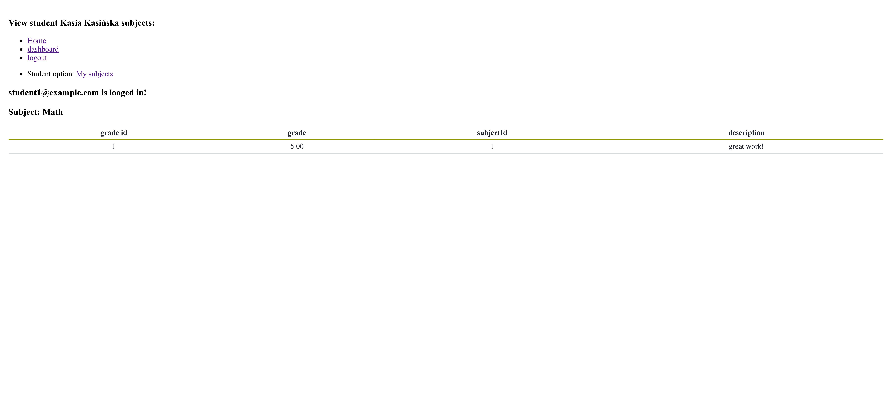


## 👨‍💻 Author

Created by **Jarosław Baumgart**.

## 📜 License

This project is available under the **MIT License**.

## 📬 Contact

If you have any questions, feel free to reach out:

🔗 **GitHub:** [Jaroslaw-Baumgart](https://github.com/Jaroslaw-Baumgart)  
📧 **Email:** jaroslawbaumgart@gmail.com

## ✨ Future Plans
One day, I might rebuild this project using React — I promise. 😉


